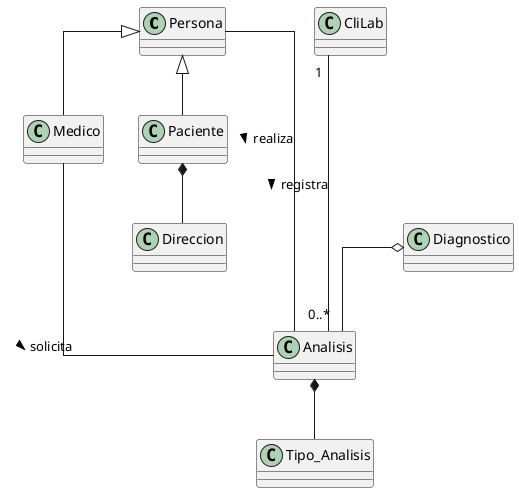

# 2/4 Ejercicio 1

El Laboratorio de Análisis Clínicos CliLab” ha comenzado el desarrollo de un sistema para la registración de los análisis realizados por sus pacientes y el profesional que los solicita. Entre los datos personales deben registrarse nombre y apellido de la persona, DNI, dirección (la dirección estará formada por la calle, el número y el barrio), localidad, provincia. Es importante conocer el diagnostico presuntivo por el cual se realiza el análisis actual, además se deberá resguardar el tipo a de análisis, la fecha de realización y entrega del análisis.

Consigna Para el escenario propuesto identificar las clases, sus atributos, métodos, y asociaciones simples, representándolos en UML.

1 asocaicion simple
2 herencia
3 agregacion
4 agregacion
5 asociacion
6 composicion
7 asociacion
8 composicion
9 herencia
