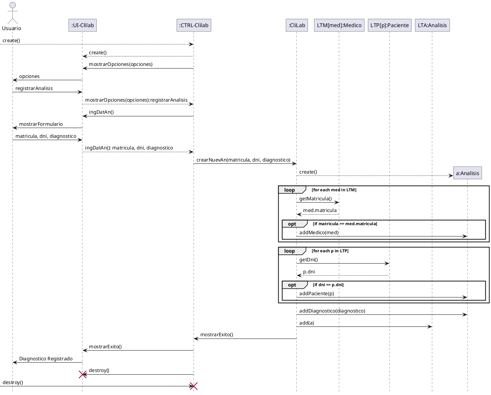
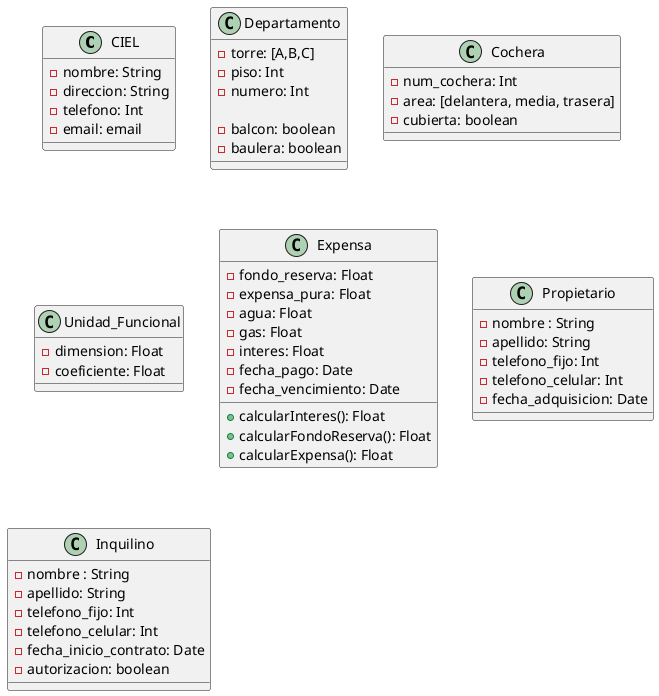

# 2/4 Ejercicio 1

El Laboratorio de Análisis Clínicos CliLab” ha comenzado el desarrollo de un sistema para la registración de los análisis realizados por sus pacientes y el profesional que los solicita. Entre los datos personales deben registrarse nombre y apellido de la persona, DNI, dirección (la dirección estará formada por la calle, el número y el barrio), localidad, provincia. Es importante conocer el diagnostico presuntivo por el cual se realiza el análisis actual, además se deberá resguardar el tipo a de análisis, la fecha de realización y entrega del análisis.

Consigna Para el escenario propuesto identificar las clases, sus atributos, métodos, y asociaciones simples, representándolos en UML.

1 asocaicion simple
2 herencia
3 agregacion
4 agregacion
5 asociacion
6 composicion
7 asociacion
8 composicion
9 herencia

La librería “Sarmiento” es una empresa familiar dedicada a la venta de toda clase
de libros, aunque se especializa en libros técnicos, actualmente posee un sistema
donde se registra información acerca de sus clientes, consistente en DNI,
nombre y apellido, dirección, teléfono, correo electrónico y edad,
además se almacenan todas las ventas que realizan y los libros involucrados en
cada una de ellas. Para competir con las grandes cadenas de librerías desean implementar
un programa de fidelización, en el que los clientes “Premium” puedan acumular o
canjear puntos en las compras que ellos realicen, a estos se les asignará una tarjeta
donde se registrarán dichos movimientos.

Ejercicio 5

WGE es un juego de plataformas 2D en el que el jugador encarna al héroe que debe salvar al universo
a través de 10 niveles y posee solo 3 vidas. Cada nivel cuenta con varios tipos de elementos 
como los enemigos (monstruos, naves y tanques) que pueden moverse de manera autónoma, disparar,
chocar, etc. o elementos del escenario con los que no se interactúa y están fijos,
aunque pueden tener animaciones.

Dados los ejercicios 1 y 2 de la Guía de TP N°5, modele las siguientes interacciones:
- Búsqueda de médico por número de matrícula.
- Búsqueda de pacientes por apellido.
- Registrar un nuevo análisis.

### BUSQUEDA DE MEDICO POR NUMERO DE MATRICULA

# Busqueda de pacientes por apellido

- aqui se tendra que hacer un alista auxiliar por si encuentra mas de un paciente con el mismo apellido

### Forma alternativa con selector en LTP

### REGISTRAR UN NUEVO ANALISIS
> esto representa el camino feliz, no se tiene en cuenta errores

---

**Ejercicio 7**

La administración de las torres de edificios “CIEL” necesita llevar un registro detallado de los pagos de expensas realizados por los habitantes. El edificio está dividido en tres torres: A, B y C. Cada torre cuenta con una cantidad distinta de departamentos por piso, y cada departamento se identifica por su torre, piso y número.

Los departamentos se diferencian por la presencia o ausencia de balcón y baulera. Además, el edificio dispone de cocheras, que se identifican por un número y pueden estar ubicadas en diferentes áreas del predio: delantera, media o trasera. Las cocheras también pueden ser cubiertas o descubiertas.

Tanto los departamentos como las cocheras tienen un número de Unidad Funcional, que incluye una dimensión y un coeficiente calculado a partir de la dimensión y ubicación de la unidad. Este coeficiente se utiliza para calcular el fondo de reserva, un monto que forma parte de la expensa.

Para calcular la expensa mensual, se consideran las características específicas de cada unidad funcional. Los datos necesarios incluyen: expensa pura, agua, fondo de reserva y gas. Es crucial registrar la fecha de vencimiento, la fecha de pago y los intereses por pago fuera de término. Los intereses se calculan de la siguiente manera:
- Del 11 al 20 del mes: 0,5%
- Del 21 al 31 del mes: 1% adicional
- Fuera del mes: 1,5%

También es necesario contar con la información de los propietarios de las unidades funcionales, incluyendo: nombre y apellido, teléfono fijo y celular, así como la fecha de adquisición del inmueble. Si la unidad funcional se alquila, se deben registrar los datos del inquilino: nombre y apellido, teléfono fijo y celular, fecha de inicio del contrato, y si tiene autorización del dueño para asistir a las reuniones de consorcio.

Es importante destacar que la expensa se emite a nombre del propietario y puede ser pagada tanto por el dueño como por el inquilino, de acuerdo a un acuerdo interno entre ambas partes.

---

### Diagrama de Clases

