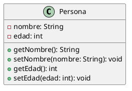
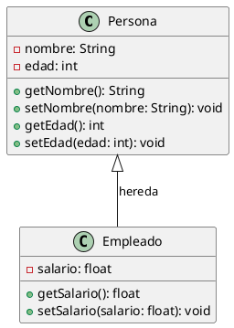
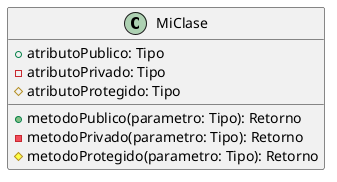

En PlantUML, puedes crear una clase utilizando la palabra clave `class` seguida del nombre de la clase. Dentro de la definición de la clase, puedes especificar atributos y métodos. Aquí tienes un ejemplo básico de cómo definir una clase en PlantUML:



En este ejemplo:

- `class Persona` define una clase llamada `Persona`.
- Dentro de las llaves `{}`, se listan los atributos y métodos de la clase.
  - `-nombre: String` y `-edad: int` son atributos privados (`-` indica privado).
  - `+getNombre(): String` y `+setNombre(nombre: String): void` son métodos públicos (`+` indica público).

Si quieres incluir relaciones entre clases, puedes hacerlo de la siguiente manera:



En este caso:

- Se define una segunda clase llamada `Empleado`.
- Se indica una relación de herencia entre `Persona` y `Empleado` con `Persona <|-- Empleado`.

# 3.6 Definiendo la Visibilidad

Cuando defines propiedades o métodos, puedes usar caracteres para establecer la visibilidad que les correspondan:

| Character | Icon for field | Icon for method | Visibility   |
|-----------|----------------|-----------------|--------------|
| -         | private        | private         | Privada      |
| #         | protected      | protected       | Protegida    |
| ~         | package private| package private | Paquete      |
| +         | public         | public          | Pública      |

## Ejemplo en PlantUML



Puedes desactivar esta característica usando el comando:
```
skinparam classAttributeIconSize 0
```


Este formato incluye:

- Una tabla que resume los caracteres usados para definir la visibilidad.
- Un ejemplo en PlantUML que muestra cómo se aplican estos caracteres.
- Una nota sobre cómo desactivar la característica de iconos de visibilidad.

¿Hay algo más que te gustaría agregar o ajustar en estos apuntes?