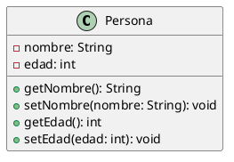
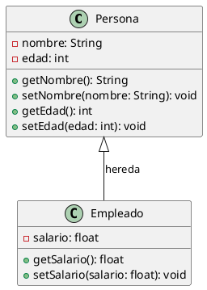

En PlantUML, puedes crear una clase utilizando la palabra clave `class` seguida del nombre de la clase. Dentro de la definición de la clase, puedes especificar atributos y métodos. Aquí tienes un ejemplo básico de cómo definir una clase en PlantUML:

En este ejemplo:

- `class Persona` define una clase llamada `Persona`.
- Dentro de las llaves `{}`, se listan los atributos y métodos de la clase.
  - `-nombre: String` y `-edad: int` son atributos privados (`-` indica privado).
  - `+getNombre(): String` y `+setNombre(nombre: String): void` son métodos públicos (`+` indica público).

Si quieres incluir relaciones entre clases, puedes hacerlo de la siguiente manera:

En este caso:

- Se define una segunda clase llamada `Empleado`.
- Se indica una relación de herencia entre `Persona` y `Empleado` con `Persona <|-- Empleado`.

Esto debería darte una buena base para comenzar a crear clases en PlantUML.