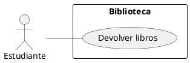

### Ejercicio 4
Considere los siguientes sistemas y sus funcionalidades

**a)** Biblioteca
1. Préstamo de libros.
2. Devolución de libros. La devolución debe verificar fechas y estado del ejemplar devuelto,
realizando las penalizaciones correspondientes.
3. Informe de libros más requeridos y con pedidos rechazados por falta de existencia.
**b)** Cajero Automático
1. Retiro de dinero.
2. Transferencia de fondos.
3. Informe de últimos movimientos.
4. Depósito en efectivo.

### Consigna
- Desarrolle el diagrama de casos de uso
- Las descripciones textuales incluyendo camino estándar
- Caminos alternativos.

----

