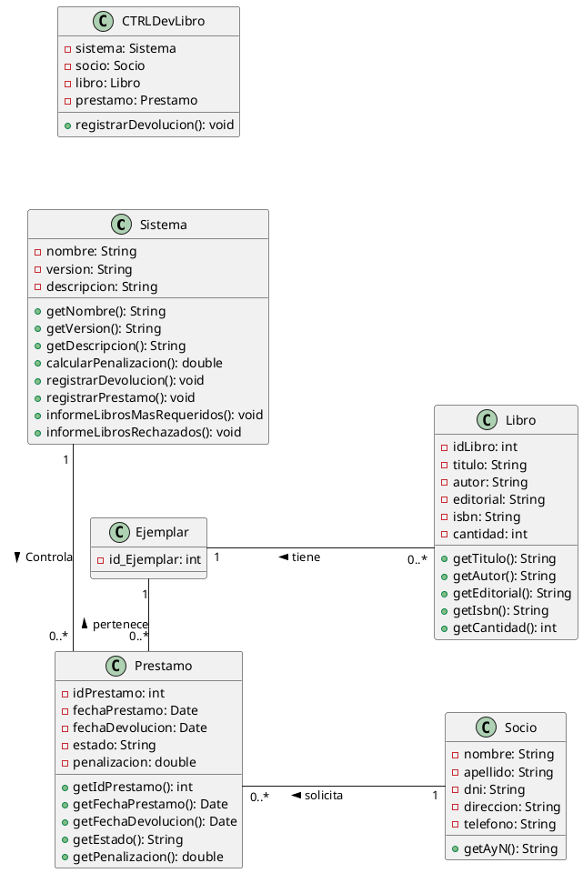

**Consigna**: Considere el [[Ejercicio 4]] de la guía anterior, haga la realización de los casos de uso vinculados a préstamo y devolución de libros.

---

### Descripción del Caso de Uso: "Devolver libros"

| **Descripción del Caso de Uso: "Devolver libros"**                                                                                                                                                                                                                                                                                                                                                                                                             |
| -------------------------------------------------------------------------------------------------------------------------------------------------------------------------------------------------------------------------------------------------------------------------------------------------------------------------------------------------------------------------------------------------------------------------------------------------------------- |
| **Actor:** Bibliotecario **Precondición:** Préstamo realizado y bibliotecario logueado. **Postcondición:** Devolución realizada.                                                                                                                                                                                                                                                                                                                          |
| **Camino Estándar**                                                                                                                                                                                                                                                                                                                                                                                                                                             |
| 1. El sistema muestra las opciones disponibles. 2. El bibliotecario selecciona registrar devolución. 3. El sistema solicita el libro prestado. 4. El bibliotecario escanea el libro. 5. El sistema comprueba si la fecha actual se encuentra dentro del límite de devolución. 6. El sistema solicita si tiene fallas o no. 7. El bibliotecario ingresa que el libro no tiene fallas. 8. El sistema registra la información. 9. Fin del caso de uso. |
| **Camino Alternativo**                                                                                                                                                                                                                                                                                                                                                                                                                                          |
| **6.a. Libro entregado fuera de tiempo** a.1. El sistema informa la penalización que se aplicará por la entrega fuera de tiempo. a.2. El bibliotecario acepta. a.3. Vuelve al paso 6. **7.a. Libros con fallas** a.1. El bibliotecario ingresa que el libro tiene fallas. a.2. El sistema solicita la gravedad de las fallas y una descripción. a.3. El bibliotecario ingresa la información solicitada. a.4. El sistema procesa y calcula la penalización. a.5. El sistema informa la penalización que se aplicará. a.6. El bibliotecario acepta. a.7. Vuelve al paso 8. |

---

### Diagrama de Clases

