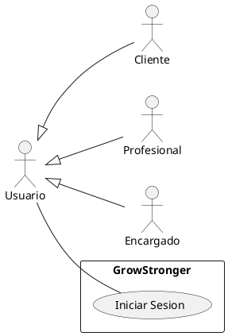

### Diagrama de Casos de uso

```plantuml

@startuml

left to right direction

actor "Usuario" as usuario

actor "Cliente" as cliente
actor "Profesional" as profesional
actor "Encargado" as encargado

usuario <|-- cliente
usuario <|-- profesional
usuario <|-- encargado

rectangle "GrowStronger" {

    usecase "Iniciar Sesion" as IS
    usuario -- IS


    ' parte clientes


    ' parte profesional


}


@enduml
```
