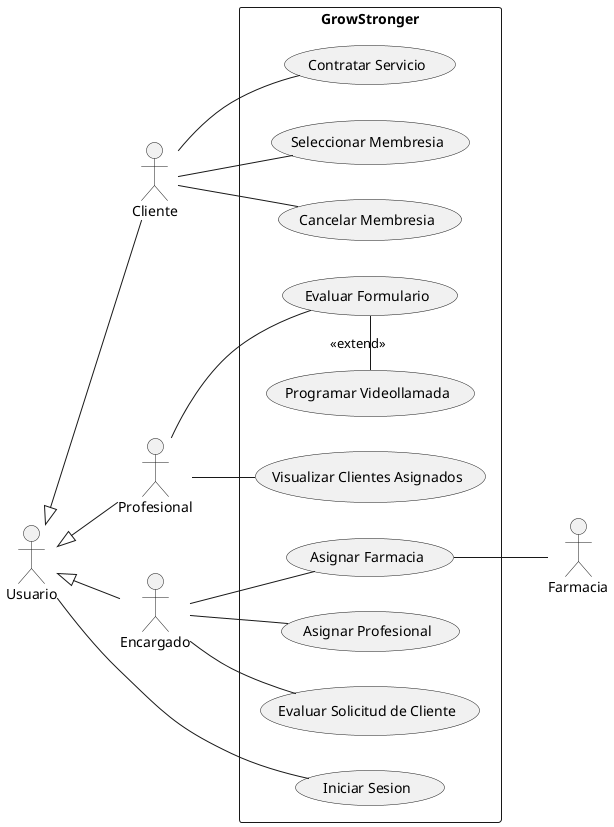
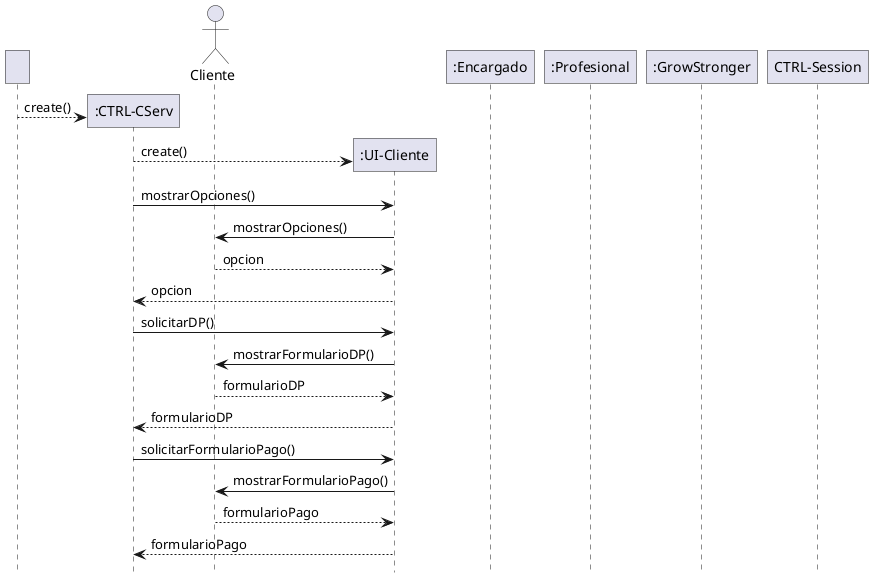

### Diagrama de Casos de uso

### Diagrama de Secuencia para el CU "*Contratar Servicio*"

> tener en cuenta que primero se le pide un formulario de datos personales y despues un formulario de pago

