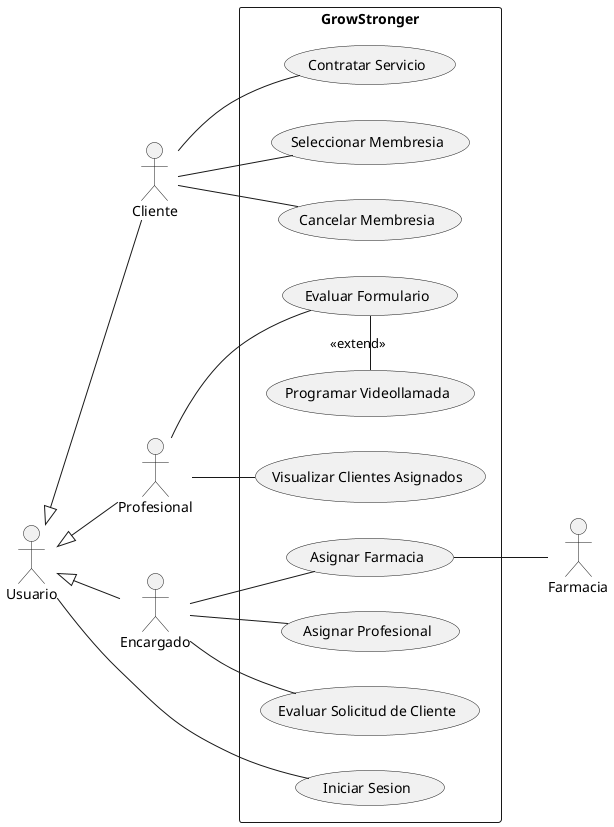
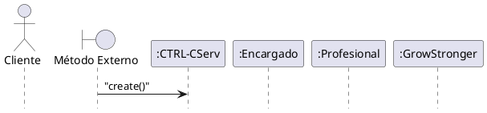

### Diagrama de Casos de uso

```plantuml

@startuml

left to right direction

actor "Usuario" as usuario

actor "Cliente" as cliente
actor "Profesional" as profesional
actor "Encargado" as encargado

usuario <|-- profesional
usuario <|-- encargado

' tambien se requiere un actor secundario Farmacia
actor "Farmacia" as farmacia

' para mi los usuarios para el sistema deben estar logueados si o si
' por lo que se debe iniciar sesion

usuario <|-- cliente


rectangle "GrowStronger" {
    
    ' caso de uso de usuario
    usecase "Iniciar Sesion" as IS
    usuario -- IS


    ' parte clientes
    usecase "Contratar Servicio" as CS
    usecase "Seleccionar Membresia" as SeleccMem
    usecase "Cancelar Membresia" as cancelMem
    cliente -- CS
    cliente -- SeleccMem
    cliente -- cancelMem

    ' parte profesional
    usecase "Evaluar Formulario" as EF
    usecase "Programar Videollamada" as ProgVid
    usecase "Visualizar Clientes Asignados" as VCA

    profesional -- VCA
    profesional -- EF
    '---- parte del actor secundario
    EF -left- ProgVid: <<extend>>


    ' parte encargado
    usecase "Asignar Profesional" as AsignarProf
    usecase "Asignar Farmacia" as AF
    usecase "Evaluar Solicitud de Cliente" as ESC

    encargado -- AF
    encargado -- AsignarProf
    encargado -- ESC


    ' actor secundario farmacia
    farmacia -up- AF

}


@enduml
```

### Diagrama de Secuencia para el CU "*Contratar Servicio*"

```plantuml
@startuml
' Escondiendo el footbox
hide footbox

actor "Cliente" as cliente

' Definimos un boundary para representar un método externo
boundary "Método Externo" as metodoExterno

participant ":CTRL-CServ" as ctrlC

metodoExterno -> ctrlC : "create()"
create ctrlC

participant ":Encargado" as enc
participant ":Profesional" as prof
participant ":GrowStronger" as GS

@enduml


```
