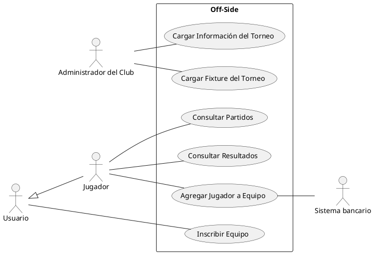

	El club “Off-Side” está organizando un campeonato de fútbol 5, y desea desarrollar una aplicación
	web para permitir la inscripción de los equipos y el seguimiento de los partidos.
	Un administrativo del club deberá cargar la información del nuevo torneo, indicando: nombre del
	torneo, fecha/s en las que se desarrollará, modalidad del torneo (todos contra todos, por grupos,
	etc.), cantidad de jugadores por equipo, fecha límite de inscripción y arancel de inscripción por
	equipo.
	Una persona registrada en el sitio web será el responsable de realizar la inscripción del equipo, el
	mismo podrá o no ser jugador. Primero deberá agregar el equipo: con un nombre y clave de
	inscripción que usarán los jugadores para agregarse al equipo. Se debe verificar que el nombre del
	equipo no exista. En ciertas ocasiones el equipo ya se encuentra conformado por haber participado
	en otro torneo. En cualquier caso, el responsable del equipo debe elegir a qué torneo disponible
	inscribirse. Al finalizar este proceso se enviará un mail al responsable con el comprobante de pre-
	inscripción.
	Cada jugador debe agregarse a un equipo existente, para ello deberá proporcionar su email con el
	cual el sistema verificará si ya se encuentra registrado. Si es así, solicitará una contraseña; sino
	pedirá que se carguen los siguientes datos: DNI, Nombre y Apellido, email, Teléfono, y Fecha de
	Nacimiento. En cualquier caso, deberá indicar el nombre del equipo y la clave de inscripción
	proporcionada por el responsable del equipo. Además, se debe considerar que el máximo de
	jugadores por equipo es 7.
	La inscripción del equipo quedará efectiva al momento de realizar el pago del arancel. El pago de
	la inscripción puede realizarse por tarjeta de crédito o débito. En ambos casos deberán cargarse los
	datos requeridos para la transacción. Una vez confirmada la operación se emitirá un comprobante
	con los datos de pago y la confirmación de la inscripción. En el caso de que transcurran 10 días
	desde el momento de la preinscripción sin haberse efectuado el pago elsistema deberá dar de
	baja las pre-inscripciones realizadas.
	Luego de la fecha límite de inscripción, se deberá cargar el fixture del torneo. Deberá elegirse los
	equipos que deberán enfrentarse, y cargar día y horario del partido. En caso de que la cantidad de
	equipos sea insuficiente para realizar el torneo este se cancela y se informa a los responsables de
	los equipos que se hayan inscripto.
	Cada jugador del equipo podrá consultar los partidos que deberá jugar su equipo, deberá poder
	ver los equipos a los que enfrenta y los días y horarios de los partidos. También podrá consultar
	los resultados de su equipo y de los demás equipos que participan del mismo torneo.
	

## Escenario

El club “Off-Side” está organizando un campeonato de fútbol 5 y desea desarrollar una aplicación web para permitir la inscripción de los equipos y el seguimiento de los partidos.

### Funcionalidades del Administrador del Club

Un administrativo del club deberá cargar la información del nuevo torneo, indicando:
- **Nombre del torneo**
- **Fecha/s en las que se desarrollará**
- **Modalidad del torneo** (todos contra todos, por grupos, etc.)
- **Cantidad de jugadores por equipo**
- **Fecha límite de inscripción**
- **Arancel de inscripción por equipo**

### Funcionalidades del Responsable del Equipo

Una persona registrada en el sitio web será responsable de realizar la inscripción del equipo. Esta persona podrá o no ser jugador. 
Primero deberá agregar el equipo:
- **Nombre del equipo**
- **Clave de inscripción** (que usarán los jugadores para agregarse al equipo)

Se debe verificar que el nombre del equipo no exista. En ciertas ocasiones el equipo ya se encuentra conformado por haber participado en otro torneo. El responsable del equipo debe elegir a qué torneo disponible inscribirse. Al finalizar este proceso, se enviará un correo al responsable con el comprobante de pre-inscripción.

### Funcionalidades del Jugador

Cada jugador debe agregarse a un equipo existente. Para ello deberá proporcionar su email con el cual el sistema verificará si ya se encuentra registrado. Si es así, solicitará una contraseña; si no, pedirá que se carguen los siguientes datos:
- **DNI**
- **Nombre y Apellido**
- **Email**
- **Teléfono**
- **Fecha de Nacimiento**

En cualquier caso, deberá indicar el nombre del equipo y la clave de inscripción proporcionada por el responsable del equipo. Además, se debe considerar que el máximo de jugadores por equipo es 7.

### Confirmación de la Inscripción

La inscripción del equipo quedará efectiva al momento de realizar el pago del arancel. El pago de la inscripción puede realizarse por tarjeta de crédito o débito. En ambos casos, deberán cargarse los datos requeridos para la transacción. Una vez confirmada la operación, se emitirá un comprobante con los datos de pago y la confirmación de la inscripción.

En el caso de que transcurran 10 días desde el momento de la pre-inscripción sin haberse efectuado el pago, el sistema deberá dar de baja las pre-inscripciones realizadas.

### Carga del Fixture

Luego de la fecha límite de inscripción, se deberá cargar el fixture del torneo. Se elegirá los equipos que deberán enfrentarse y se cargará día y horario del partido. En caso de que la cantidad de equipos sea insuficiente para realizar el torneo, este se cancela y se informa a los responsables de los equipos que se hayan inscripto.

### Consultas de los Jugadores

Cada jugador del equipo podrá:
- Consultar los partidos que deberá jugar su equipo.
- Ver los equipos a los que enfrentará y los días y horarios de los partidos.
- Consultar los resultados de su equipo y de los demás equipos que participan del mismo torneo.

## Consigna

1. Realizar el diagrama de casos de uso completo. (14)
2. Describir el CU “Agregar jugador a equipo”. Agregue 2 caminos alternativos, los que considere más relevantes y la descripción de uno de ellos. (14)
3. Realización del caso de uso “Agregar jugador a equipo”:
    a. Confeccionar las tarjetas CRC de 2 clases entidad (8)
    b. Desarrollar el diagrama de clases UML, para todas las clases identificadas especificar sus atributos y operaciones (22)
    c. Desarrollar el diagrama de secuencia UML para el camino estándar. (24)

---

# Resolución

1. Diagrama de Casos de Uso

