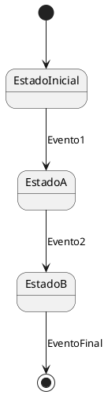

## Algunos tips para realizar Diagramas de Estados
### 1. **Entiende bien el Sistema**
   Antes de empezar a dibujar el diagrama, asegúrate de comprender completamente el sistema o proceso que estás modelando. Es fundamental identificar:
   - Los **estados** que el sistema puede tener (por ejemplo, "Colgado", "Descolgado", etc.).
   - Las **transiciones** entre estos estados.
   - Los **eventos o disparadores** que causan que las transiciones ocurran (como "Descolgar", "Iniciar Marcado").
   - Las **acciones** que deben ocurrir cuando una transición se produce o un estado se entra/sale.

### 2. **Define los Estados**
   Los **estados** son los momentos específicos del sistema donde se encuentra en un "modo" particular. Cada estado debe estar claramente definido y ser una descripción del comportamiento del sistema en ese momento.
   - Los estados deben ser **concisos y específicos**, como "Marcando", "Conectando", "Hablando".
   - Usa **nombres claros** que reflejen la acción o el comportamiento en ese estado.

### 3. **Usa Transiciones Claras**
   Las **transiciones** son las flechas que conectan los estados. Estas representan los eventos que causan que el sistema pase de un estado a otro. Asegúrate de:
   - **Etiquetar bien las transiciones** con el evento que las desencadena (por ejemplo, "Descolgar" para pasar de "Colgado" a "Descolgado").
   - **Evita transiciones ambiguas**. Cada transición debe ser clara y representar un cambio de estado lógico.
   - Usa **condiciones de guarda** si es necesario. Estas condiciones limitan cuándo una transición ocurre (por ejemplo, si el tiempo es mayor que 15 segundos).

### 4. **Evita Complejidad Innecesaria**
   Un diagrama de máquina de estados debe ser **lo más simple posible**, sin agregar detalles irrelevantes. Mantén el enfoque en los aspectos más importantes del comportamiento del sistema.
   - Si el sistema es complejo, divide el diagrama en **subdiagramas** o usa **estados compuestos** para simplificarlo.
   - Evita agregar demasiados detalles que puedan hacer que el diagrama sea confuso o difícil de leer.

### 5. **Usa Estados Iniciales y Finales Claros**
   - **Estado inicial**: Representa el punto de partida del sistema. En un diagrama PlantUML, se marca con `[*]`.
   - **Estado final**: Representa el punto de terminación del sistema. También se marca con `[*]`, pero con una transición que va a ese punto, como un ciclo de "fin".

### 6. **Claridad en los Eventos de Transición**
   - Los **eventos de transición** deben estar claramente especificados. Por ejemplo, un evento puede ser algo como "Llamada atendida" o "Tiempo excedido". Estos eventos pueden tener **condiciones de guarda** que las modifiquen.
   - Las **acciones** que ocurren cuando se realiza la transición (como "Activar tono de marcado") deben estar bien indicadas en la misma transición o dentro del estado.

### 7. **Evita Ambigüedades**
   Asegúrate de que cada transición y estado sean **únicos y sin ambigüedades**. Si algo no está claro, es posible que necesites ajustar tu modelo o agregar más detalles. Es importante que cualquiera que vea el diagrama pueda entender cómo funciona el sistema sin explicaciones adicionales.

### 8. **Revisa la Consistencia de Nombres y Símbolos**
   - **Nombres consistentes**: Usa una convención de nombres coherente para estados, transiciones y eventos. Evita utilizar nombres largos o complicados.
   - **Simbología estándar**: Usa la simbología estándar de diagramas de estados (por ejemplo, estados como rectángulos redondeados y transiciones como flechas).

### 9. **Aprovecha los Estados Compuestos**
   Si tu sistema es complejo, puedes utilizar **estados compuestos** o **subestados** para agrupar estados relacionados. Esto simplifica el diagrama y permite representar sistemas jerárquicos de manera más clara.

   Ejemplo: Un estado como "Marcando" podría estar compuesto de subestados como "Esperando respuesta" o "Marcación en progreso".

### 10. **Usa Plantillas y Herramientas de Modelado**
   - Si estás utilizando herramientas como **PlantUML**, asegúrate de seguir su sintaxis y convenciones.
   - Practica utilizando las plantillas de UML que te permitan dibujar diagramas rápidamente y evitar errores comunes.

### 11. **Documenta Bien el Diagrama**
   Asegúrate de que tu diagrama esté acompañado de **comentarios** o una **documentación breve** que explique:
   - Los **estados** y qué representan.
   - Los **eventos** que desencadenan las transiciones.
   - Las **acciones** que ocurren al entrar o salir de un estado.
   - Las **condiciones de guarda**, si las hay, que controlan las transiciones.

### 12. **Revisión y Feedback**
   Después de realizar tu diagrama, revisalo con otros colegas o personas que no estén tan familiarizadas con el sistema. A menudo, una segunda opinión puede detectar áreas confusas o posibles mejoras.

---

### Resumen de lo que debes hacer al hacer un diagrama de máquina de estados:

- **Define claramente los estados** del sistema.
- **Establece eventos o disparadores** para cada transición entre estados.
- Usa **condiciones de guarda** para hacer transiciones condicionales si es necesario.
- Mantén el diagrama **sencillo, claro y comprensible**.
- **No añadas detalles innecesarios**, y divide el diagrama si es muy complejo.
- Asegúrate de **tener un estado inicial** y **final** claros.

### Ejemplo Básico de Diagrama de Máquina de Estados en PlantUML:

Si sigues estos principios y prácticas, mejorarás mucho la calidad de tus diagramas de máquina de estados, ¡y te resultará mucho más fácil entender y crear sistemas complejos!