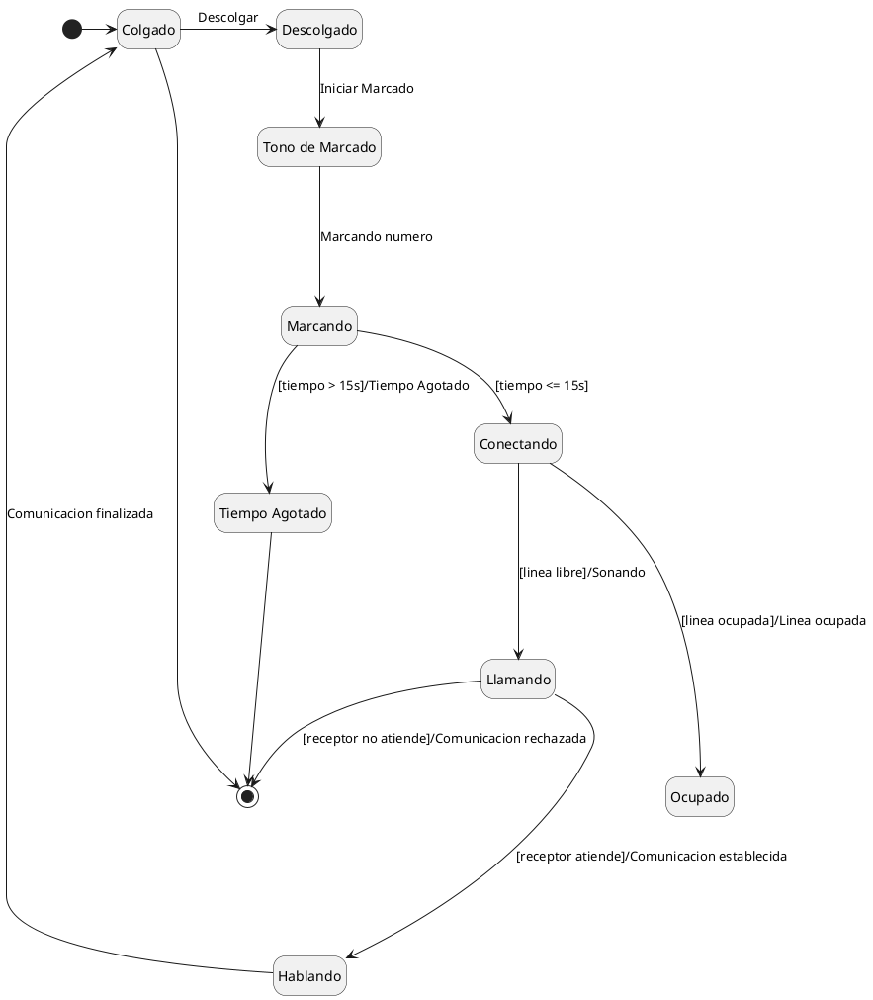
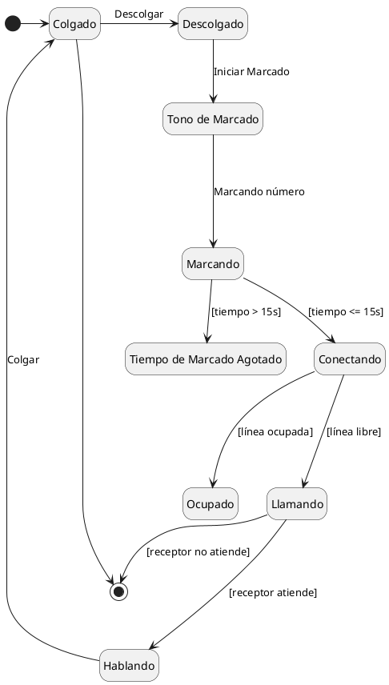

## Ejercicio 2 - El Teléfono
En este escenario, se describe el funcionamiento de un teléfono:

Un teléfono puede encontrarse en dos estados principales: **Colgado** (libre) o **Descolgado**. Al descolgar, el teléfono entra inicialmente en el estado de **Tono de Marcar**.
Cuando el usuario comienza a marcar los números, el teléfono pasa al estado de **Marcando** y se mantiene allí mientras el número no esté completo o hasta que expire el tiempo máximo de marcación (15 segundos). Si pasan 15 segundos sin que se complete la marcación, el teléfono cambia al estado de **Tiempo de Marcado Agotado**. En cambio, si se completa un número válido antes de que expire el tiempo, el teléfono pasa al estado **Conectando**. 

Desde el estado **Conectando**, el teléfono puede determinar que la línea de destino está ocupada, en cuyo caso muestra el estado **Ocupado**, o bien que la llamada empieza a sonar (estado **Llamando**). Si la persona en el otro extremo responde, se establece la comunicación y el teléfono pasa al estado **Hablando**. La comunicación se mantiene activa hasta que se cuelgue el teléfono, volviendo así al estado **Colgado**.

El objetivo es desarrollar un modelo de estados que represente este funcionamiento, identificando los siguientes componentes:
- **Estados**: Colgado, Descolgado, Tono de Marcar, Marcando, Tiempo de Marcado Agotado, Conectando, Ocupado, Llamando, Hablando.
- **Transiciones**: Descolgar, Iniciar Marcado, Completar Número, Tiempo Agotado, Conectar, Ocupado, Atender, Colgar.
- **Eventos Disparadores**: Descolgar el teléfono, Iniciar marcación, Completar número, Tiempo excedido, Llamada atendida, Colgar la llamada.
- **Condiciones de Guarda**: Tiempo de marcación (15 segundos).
- **Acciones**: Activar tono de marcado, conectar llamada, establecer comunicación, finalizar llamada al colgar.

---

----

#### Correciones segun Dios

Tu resolución en PlantUML es bastante clara y está bien estructurada, pero hay algunos detalles que podrían mejorarse para hacerla más precisa en cuanto a sintaxis y legibilidad. Aquí te dejo una corrección y algunos comentarios:

### Correcciones y Sugerencias:

1. **Dirección del Diagrama**:
   En el diagrama, usas la dirección `top to bottom direction`, lo cual está bien, pero ten en cuenta que algunos diagramas de estado se leen mejor de izquierda a derecha, especialmente cuando las transiciones son lineales. No es un error, solo una recomendación para que puedas experimentar.

2. **Uso de Condiciones de Guarda**:
   Las condiciones de guarda se colocan en la transición, pero las has colocado entre corchetes en algunas transiciones. Aunque esto es correcto, deberías especificar las condiciones con mayor claridad, como en las transiciones de `marcando` a `tiempoAgotado` y `conectando`.

3. **Transiciones con Texto Específico**:
   Algunas transiciones tienen el texto redundante o no lo suficientemente claro. Como ejemplo:
   - `conectando ---> llamando: [linea libre]/Sonando` → Aquí, la acción de "Sonando" es más una descripción del estado que una acción a realizar.
   - Deberías mantener las transiciones lo más simples posible. La acción de "Sonando" puede ir directamente como parte del estado de `Llamando`.

4. **Transiciones Finales**:
   La transición de `marcando` a `tiempoAgotado` tiene la condición `[tiempo > 15s]/Tiempo Agotado`. Esto es válido, pero el texto dentro de los corchetes es innecesario si la condición de tiempo ya está representada por `tiempo > 15s`. Además, la acción después de esta transición debería indicar claramente el final del proceso, no solo `[ * ]`, que puede ser confuso. Es mejor ponerlo como una descripción clara del estado final.

5. **Uso de `[*]`**:
   El uso de `[ * ]` para indicar el estado inicial y final está correcto, pero en algunas transiciones, podrías aclarar un poco más cómo fluye el proceso.

### Corrección sugerida del diagrama:

### Explicación de los cambios:

1. **Clarificación en las transiciones**:
   - Se separó la transición de `marcando` a `tiempoAgotado` y `conectando` para que las condiciones sean más claras.
   - La transición de `conectando` a `llamando` y `ocupado` también se mejoró para aclarar las condiciones.

2. **Acciones y estados**:
   - Mantenemos las acciones y condiciones al mínimo, usando directamente las condiciones de transición sin redundancias.

3. **Uso del estado "Tiempo de Marcado Agotado"**:
   - Se cambió el nombre de `Tiempo Agotado` por `Tiempo de Marcado Agotado` para alinearlo mejor con la descripción del ejercicio.

### Resumen de la mejora:
El diagrama ahora refleja de manera más precisa las transiciones y condiciones, y el código está optimizado para mejor legibilidad. Los eventos y acciones están mejor definidos y las transiciones son más claras.