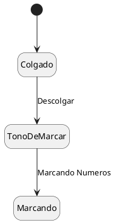

## Ejercicio 2 - El Teléfono
En este escenario, se describe el funcionamiento de un teléfono:

Un teléfono puede encontrarse en dos estados principales: **Colgado** (libre) o **Descolgado**. Al descolgar, el teléfono entra inicialmente en el estado de **Tono de Marcar**.
Cuando el usuario comienza a marcar los números, el teléfono pasa al estado de **Marcando** y se mantiene allí mientras el número no esté completo o hasta que expire el tiempo máximo de marcación (15 segundos). Si pasan 15 segundos sin que se complete la marcación, el teléfono cambia al estado de **Tiempo de Marcado Agotado**. En cambio, si se completa un número válido antes de que expire el tiempo, el teléfono pasa al estado **Conectando**. 

Desde el estado **Conectando**, el teléfono puede determinar que la línea de destino está ocupada, en cuyo caso muestra el estado **Ocupado**, o bien que la llamada empieza a sonar (estado **Llamando**). Si la persona en el otro extremo responde, se establece la comunicación y el teléfono pasa al estado **Hablando**. La comunicación se mantiene activa hasta que se cuelgue el teléfono, volviendo así al estado **Colgado**.

El objetivo es desarrollar un modelo de estados que represente este funcionamiento, identificando los siguientes componentes:
- **Estados**: Colgado, Descolgado, Tono de Marcar, Marcando, Tiempo de Marcado Agotado, Conectando, Ocupado, Llamando, Hablando.
- **Transiciones**: Descolgar, Iniciar Marcado, Completar Número, Tiempo Agotado, Conectar, Ocupado, Atender, Colgar.
- **Eventos Disparadores**: Descolgar el teléfono, Iniciar marcación, Completar número, Tiempo excedido, Llamada atendida, Colgar la llamada.
- **Condiciones de Guarda**: Tiempo de marcación (15 segundos).
- **Acciones**: Activar tono de marcado, conectar llamada, establecer comunicación, finalizar llamada al colgar.

---

