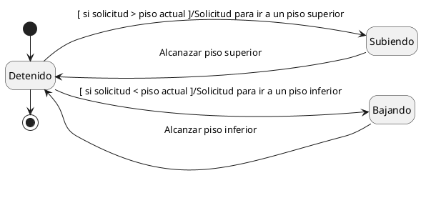
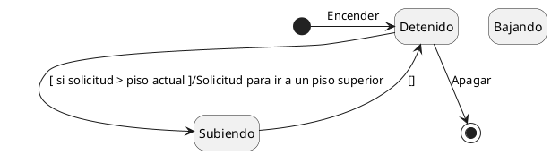

## Ejercicio 3 - El Ascensor

El objetivo es desarrollar un modelo de ciclo de vida para un ascensor que puede encontrarse en los estados de **Detenido**, **Subiendo** o **Bajando**. Los eventos que puede recibir el ascensor son:

- **Solicitud para ir a un piso específico**
- **Alcanzar un piso**

Considere dos variantes para el problema:

1. **Ascensor sin memoria**: el ascensor solo puede recibir solicitudes cuando está detenido.
2. **Ascensor con memoria**: el ascensor puede almacenar hasta cinco solicitudes. En esta versión, el ascensor prioriza las detenciones no según el orden en que las solicitudes fueron recibidas, sino de acuerdo con su proximidad al piso actual.

---

### Ascensor sin memoria

### Ascensor con memoria
- El ascensor puede almacenar hasta cinco solicitudes. En esta versión, el ascensor prioriza las detenciones no según el orden en que las solicitudes fueron recibidas, sino de acuerdo con su proximidad al piso actual.

