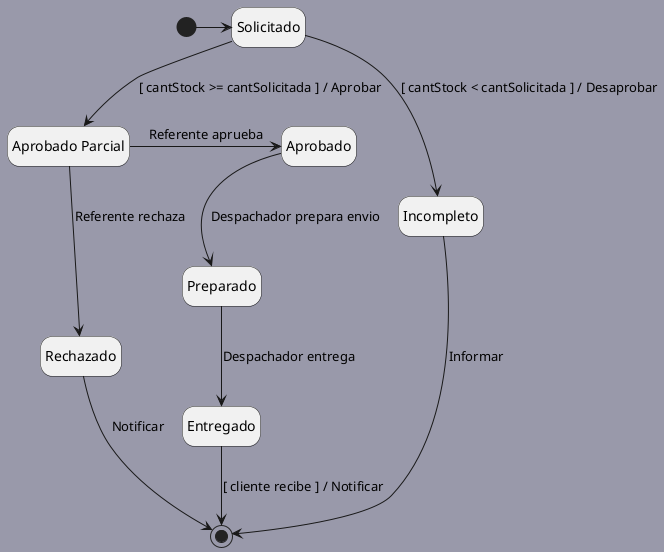

## Ej 4 Diagrama de Estados

[[Parcial_Pinturas-ej4.excalidraw]]

```plantuml
@startuml

skinparam backgroundColor #99a
hide empty description

state "Aprobado Parcial" as aprobado_parcial
state "Aprobado" as aprobado
state "Incompleto" as incompleto 
state "Rechazado" as rechazado
state "Preparado" as preparado
state "Entregado" as entregado
state "Solicitado" as solicitado

[*] -> solicitado

solicitado --> aprobado_parcial: [ cantStock >= cantSolicitada ] / Aprobar

solicitado --> incompleto: [ cantStock < cantSolicitada ] / Desaprobar

incompleto --> [*]: Informar

aprobado_parcial --> rechazado: Referente rechaza
aprobado_parcial -> aprobado: Referente aprueba

aprobado --> preparado: Despachador prepara envio

preparado --> entregado: Despachador entrega

entregado --> [*]: [ cliente recibe ] / Notificar

rechazado --> [*]: Notificar


@enduml
```
