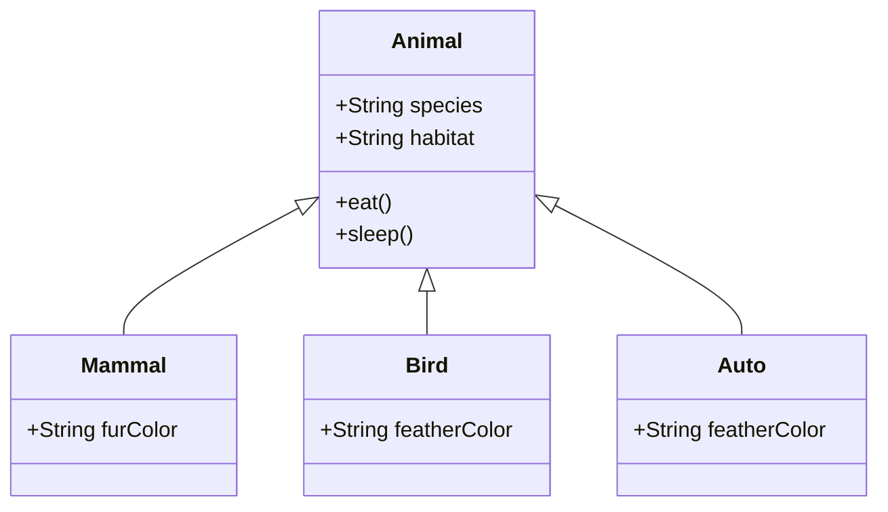

# Inicialización de Proyecto con Mermaid en Node.js

Este proyecto proporciona una plantilla básica para crear diagramas utilizando Mermaid en una aplicación web Node.js.

## Contenido del Proyecto

El proyecto consta de los siguientes archivos:

### `index.html`

Este archivo HTML carga Mermaid y el script JavaScript necesario para renderizar el diagrama. También enlaza una hoja de estilos CSS para darle estilo a la página.

```html
<!DOCTYPE html>
<html lang="en">
<head>
    <meta charset="UTF-8">
    <link rel="stylesheet" href="style/styles.css">
    <meta name="viewport" content="width=device-width, initial-scale=1.0">
    <title>Diagrama de Clases con Mermaid</title>
    <script type="module" src="script.js"></script>
</head>
<body>
    <div id="mermaid" class="container"></div>
</body>
</html>
```

### `script.js`

Este archivo JavaScript utiliza Fetch API para obtener el contenido del archivo `diagrama.mmd`, lo procesa y lo renderiza utilizando Mermaid.

```javascript
import mermaid from 'https://cdn.jsdelivr.net/npm/mermaid@10/dist/mermaid.esm.min.mjs';

mermaid.initialize({ startOnLoad: true });

async function fetchDiagram() {
    const response = await fetch('diagrama.mmd');
    if (response.ok) {
        const text = await response.text();
        const container = document.getElementById('mermaid');
        const mermaidDiv = document.createElement('div');
        mermaidDiv.className = 'mermaid';
        mermaidDiv.textContent = text;
        container.appendChild(mermaidDiv);
        mermaid.init(undefined, document.querySelectorAll('.mermaid'));
    } else {
        console.error('Error fetching the Mermaid diagram:', response.statusText);
    }
}

document.addEventListener('DOMContentLoaded', fetchDiagram);
```

### `styles.css`

Este archivo CSS proporciona estilos básicos para la página HTML.

```css
body {
    display: flex;
    justify-content: center;
    align-items: center;
    height: 100vh;
    margin: 0;
    font-family: Arial, sans-serif;
    background-color: #239ca0;
}

.container {
    background-color: #ffffff;
    box-shadow: 1px 1px 16px #114f52;
    padding: 20px;
    border-radius: 8px;
}
```

### `diagrama.mmd`

Este archivo contiene el diagrama de clases en formato Mermaid.



## Ejecución del Proyecto

1. **Instalación de Dependencias**

   Antes de ejecutar el proyecto, asegúrate de tener Node.js y npm instalados en tu sistema. Luego, instala las dependencias del proyecto ejecutando el siguiente comando en tu terminal:

   ```
   npm install
   ```

2. **Ejecución del Servidor**

   Una vez que se hayan instalado las dependencias, puedes ejecutar el servidor Node.js con el siguiente comando:

   ```
   npm start
   ```

   Esto iniciará el servidor en `http://localhost:3000`, donde podrás ver tu diagrama de clases renderizado.


---