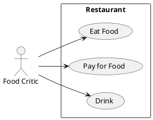

## Casos de uso de Sistema

```python
@startuml
left to right direction
actor "Food Critic" as fc
rectangle Restaurant {
usecase "Eat Food" as UC1
usecase "Pay for Food" as UC2
usecase "Drink" as UC3
}
fc --> UC1
fc --> UC2
fc --> UC3
@enduml
```



```python
@startuml
left to right direction
actor "Estudiante" as a1
rectangle "Biblioteca" {
  usecase "Devolver libros" as p2
  a1 -- p2
}
@enduml
```

### Include y Extends
```python
(checkout) .> (payment) : include

' .> linea punteada
(help) .> (checkout) : extends
```

```plantuml
(checkout) .> (payment) : include
(help) .> (checkout) : extends
```