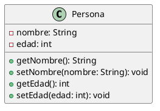
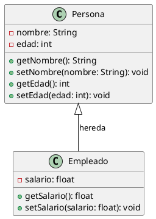
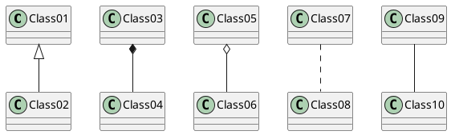
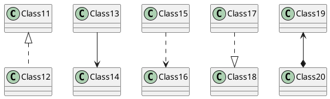
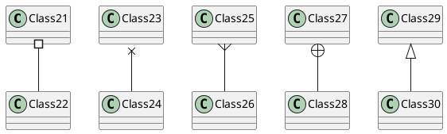
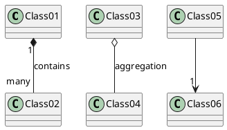
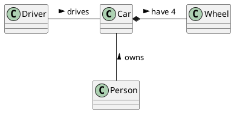
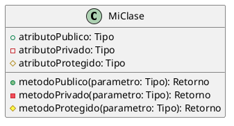

En PlantUML, puedes crear una clase utilizando la palabra clave `class` seguida del nombre de la clase. Dentro de la definición de la clase, puedes especificar atributos y métodos. Aquí tienes un ejemplo básico de cómo definir una clase en PlantUML:



En este ejemplo:

- `class Persona` define una clase llamada `Persona`.
- Dentro de las llaves `{}`, se listan los atributos y métodos de la clase.
  - `-nombre: String` y `-edad: int` son atributos privados (`-` indica privado).
  - `+getNombre(): String` y `+setNombre(nombre: String): void` son métodos públicos (`+` indica público).

Si quieres incluir relaciones entre clases, puedes hacerlo de la siguiente manera:



En este caso:

- Se define una segunda clase llamada `Empleado`.
- Se indica una relación de herencia entre `Persona` y `Empleado` con `Persona <|-- Empleado`.

# Relación entre Clases

Las relaciones entre clases se definen usando los siguientes símbolos:

| Tipo        | Símbolo | Dibujo  |
|-------------|---------|---------|
| Extensión   | `<|--`  | <|--    |
| Composición | `*--`   | *--     |
| Agregación  | `o--`   | o--     |

Es posible intercambiar `--` por `..` para tener líneas punteadas.

## Ejemplos de Relación entre Clases

### Diagrama 1



### Diagrama 2



### Diagrama 3




# Etiquetas y Cardinalidad en las Relaciones

Es posible añadir etiquetas en las relaciones, usando `:` seguido del texto de la etiqueta. Para la cardinalidad, puede usar comillas dobles `""` en cada lado de la relación.



Se puede añadir una flecha extra apuntando a un objeto, mostrando que objeto actúa sobre el otro objeto, usando `<` o `>` al inicio o al final de la etiqueta.




### Descripción de los Tipos de Relaciones

- **Extensión (`<|--`)**: Indica que una clase hereda de otra.
- **Composición (`*--`)**: Indica una relación de composición fuerte donde una clase es parte de otra y depende totalmente de ella.
- **Agregación (`o--`)**: Indica una relación de agregación donde una clase contiene a otra, pero la vida de la clase contenida no depende de la clase contenedora.
- **Relación (`--`)**: Representa una relación general entre clases.
- **Relación punteada (`..`)**: Representa una relación menos formal o sujeta a cambios entre clases.

## Tipos de Lineas Rectangulares

Para hacer que las líneas de las relaciones en PlantUML sean rectangulares en lugar de diagonales, puedes utilizar la directiva `skinparam` para establecer el estilo de las flechas.

```
skinparam linetype ortho
```

# Definiendo la Visibilidad

Cuando defines propiedades o métodos, puedes usar caracteres para establecer la visibilidad que les correspondan:

| Character | Icon for field  | Icon for method | Visibility |
| --------- | --------------- | --------------- | ---------- |
| -         | private         | private         | Privada    |
| #         | protected       | protected       | Protegida  |
| ~         | package private | package private | Paquete    |
| +         | public          | public          | Pública    |

## Ejemplo en PlantUML



Puedes desactivar esta característica usando el comando:
```
skinparam classAttributeIconSize 0
```
