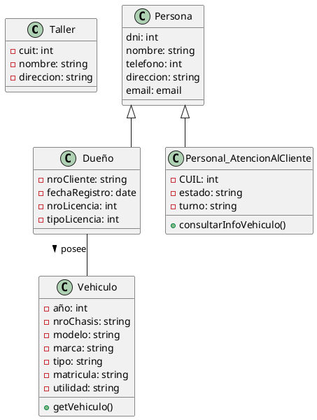

![[Pasted image 20240530013120.png]]

```plantuml
@startuml

skinparam linetype ortho

class Taller {
    -cuit: int
    -nombre: string
    -direccion: string
}

class Persona{
    dni: int
    nombre: string
    telefono: int
    direccion: string
    email: email
}

class Dueño {
    -nroCliente: string
    -fechaRegistro: date
    -nroLicencia: int
    -tipoLicencia: int
}


class Vehiculo {
    - año: int
    - nroChasis: string
    - modelo: string
    - marca: string
    - tipo: string
    -matricula: string
    -utilidad: string

    ' parte de metodos
    +getVehiculo()
}

class Personal_AtencionAlCliente{
    -CUIL: int
    -estado: string
    -turno: string

    +consultarInfoVehiculo()
}


Persona <|-- Personal_AtencionAlCliente 
Persona <|-- Dueño

Dueño -- Vehiculo: posee >

@enduml
```
