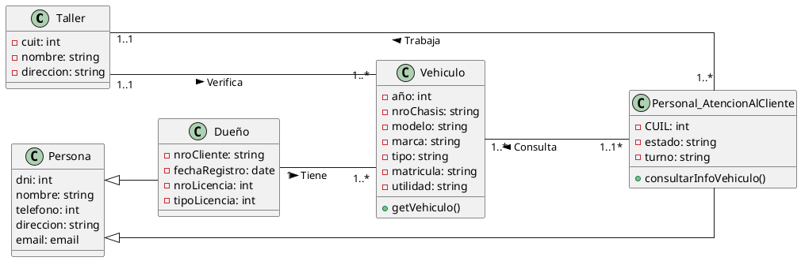
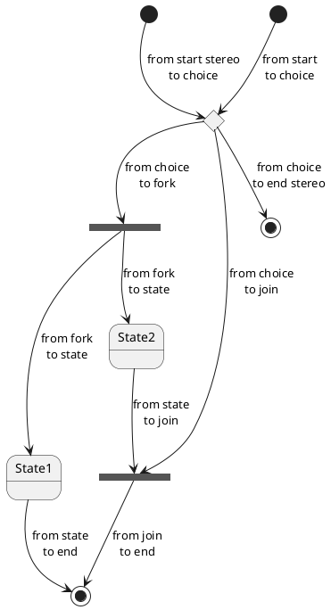

![[Pasted image 20240530024838.png]]

```plantuml
@startuml
left to right direction

skinparam linetype ortho

class Taller {
    - cuit: int
    - nombre: string
    - direccion: string
}

class Persona{
    dni: int
    nombre: string
    telefono: int
    direccion: string
    email: email
}

class Dueño {
    - nroCliente: string
    - fechaRegistro: date
    - nroLicencia: int
    - tipoLicencia: int
}

class Vehiculo {
    - año: int
    - nroChasis: string
    - modelo: string
    - marca: string
    - tipo: string
    - matricula: string
    - utilidad: string

    ' parte de metodos
    + getVehiculo()
}

class Personal_AtencionAlCliente{
    - CUIL: int
    - estado: string
    - turno: string

    + consultarInfoVehiculo()
}

' ##### PARTE DE RELACIONES #####

Persona <|-- Personal_AtencionAlCliente 
Persona <|-- Dueño

Dueño "1" --- "1..*" Vehiculo: Tiene >
Vehiculo "1..*" ---- "1..1*" Personal_AtencionAlCliente: < Consulta

Taller "1..1" -- "1..*" Personal_AtencionAlCliente: < Trabaja
Taller "1..1" ---- "1..*" Vehiculo:  Verifica >
@enduml

```

  

  

```plantuml
@startuml
state start1 <<start>>
state choice1 <<choice>>
state fork1 <<fork>>
state join2 <<join>>
state end3 <<end>>
[*] --> choice1 : from start\nto choice
start1 --> choice1 : from start stereo\nto choice
choice1 --> fork1 : from choice\nto fork
choice1 --> join2 : from choice\nto join
choice1 --> end3 : from choice\nto end stereo
fork1 ---> State1 : from fork\nto state
fork1 --> State2 : from fork\nto state
State2 --> join2 : from state\nto join
State1 --> [*] : from state\nto end
join2 --> [*] : from join\nto end
@enduml


```
